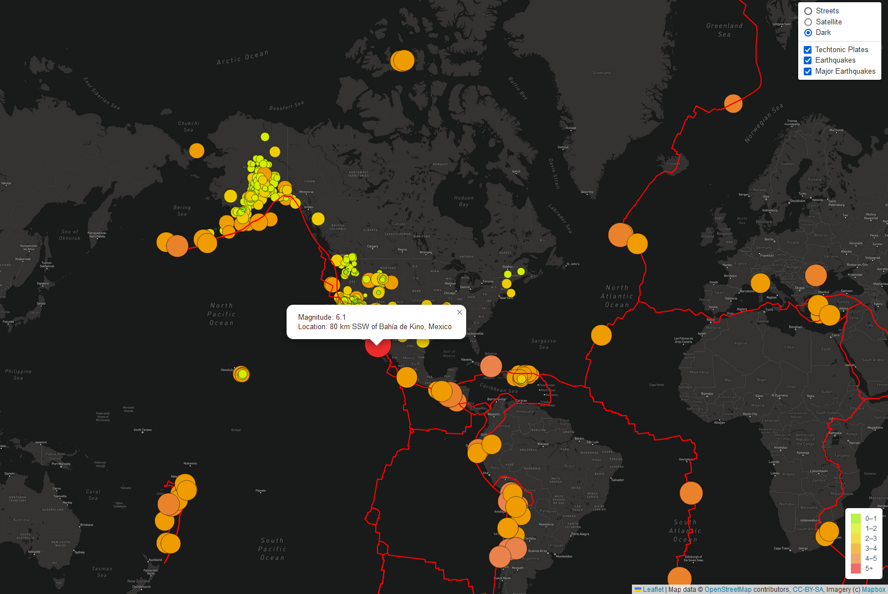

# Mapping_Earthquakes

## Purpose:
#### Basil, the head of the earthquake disaster response team, wants us to  create a visualization of earthquake data in relation to the tectonic plates’ location. This will help his team to have a better understanding of the data at hand. In addition, he wants us to create an option that will visually filter the data for earthquakes with a magnitude greater than 4.5("Major Eartquakes"). The picture below represents the final result:
 

